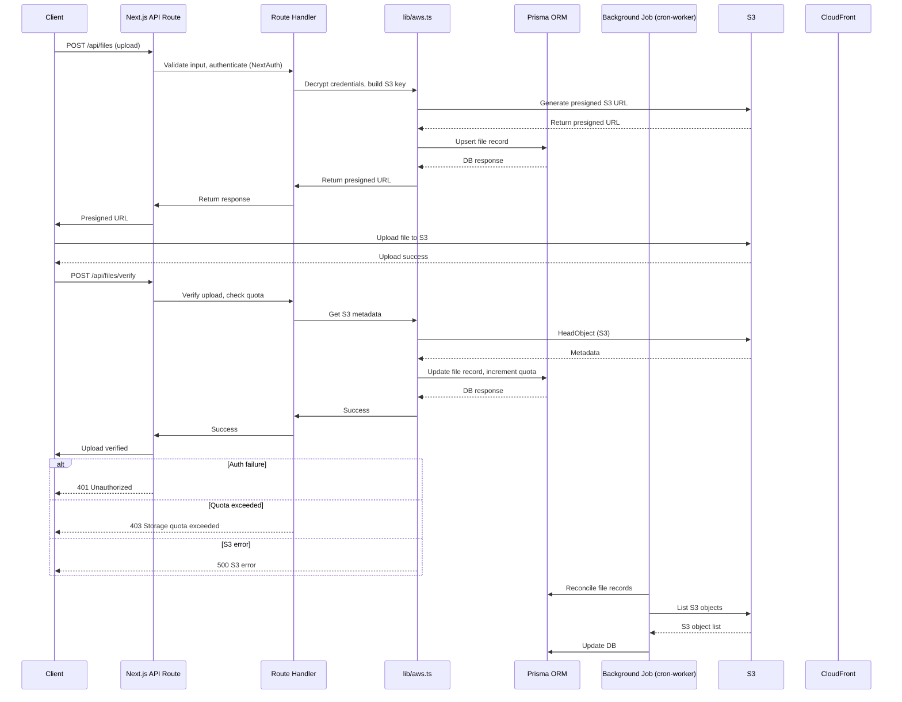

This diagram shows the sequence for the most important API flow: Secure file upload, including all layers, authentication, async steps, and at least two failure paths.

```mermaid
sequenceDiagram
  participant Client
  participant Gateway as Next.js API Route
  participant Controller as Route Handler
  participant Service as lib/aws.ts
  participant Repository as Prisma ORM
  participant Queue as Background Job (cron-worker)
  participant Worker as S3
  participant External as CloudFront

  Client->>Gateway: POST /api/files (upload)
  Gateway->>Controller: Validate input, authenticate (NextAuth)
  Controller->>Service: Decrypt credentials, build S3 key
  Service->>Worker: Generate presigned S3 URL
  Worker-->>Service: Return presigned URL
  Service->>Repository: Upsert file record
  Repository-->>Service: DB response
  Service->>Controller: Return presigned URL
  Controller->>Gateway: Return response
  Gateway->>Client: Presigned URL
  Client->>Worker: Upload file to S3
  Worker-->>Client: Upload success
  Client->>Gateway: POST /api/files/verify
  Gateway->>Controller: Verify upload, check quota
  Controller->>Service: Get S3 metadata
  Service->>Worker: HeadObject (S3)
  Worker-->>Service: Metadata
  Service->>Repository: Update file record, increment quota
  Repository-->>Service: DB response
  Service->>Controller: Success
  Controller->>Gateway: Success
  Gateway->>Client: Upload verified

  alt Auth failure
    Gateway-->>Client: 401 Unauthorized
  else Quota exceeded
    Controller-->>Client: 403 Storage quota exceeded
  else S3 error
    Service-->>Client: 500 S3 error
  end

  %% Async: Background job (cron-worker) reconciles S3 ↔ DB
  Queue->>Repository: Reconcile file records
  Queue->>Worker: List S3 objects
  Worker-->>Queue: S3 object list
  Queue->>Repository: Update DB

  %% UNCLEAR: Some flows may involve CloudFront for CDN delivery, but only if configured.
```
